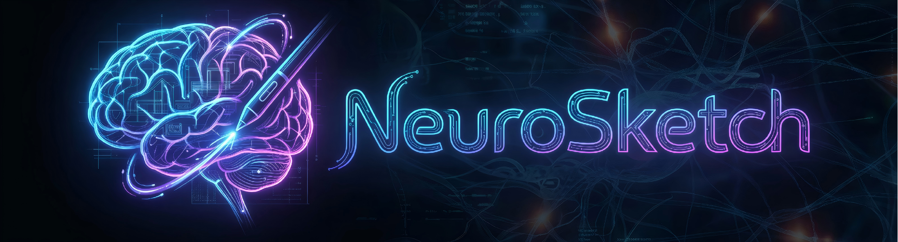
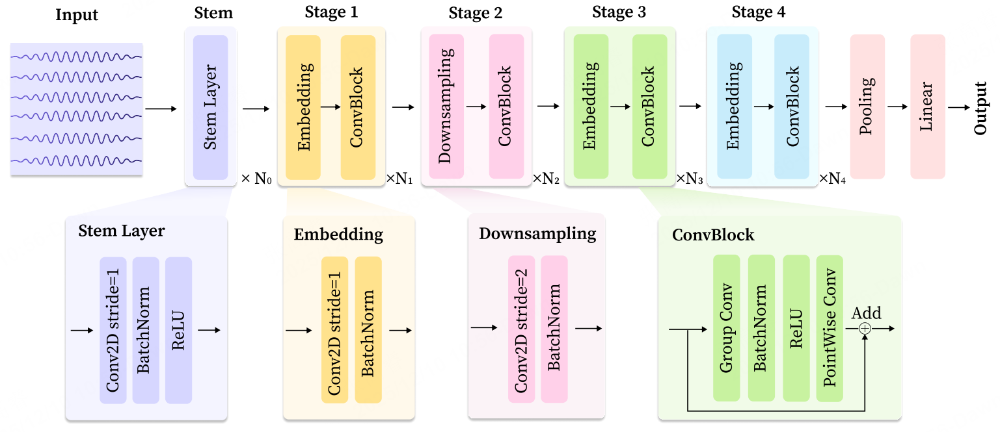
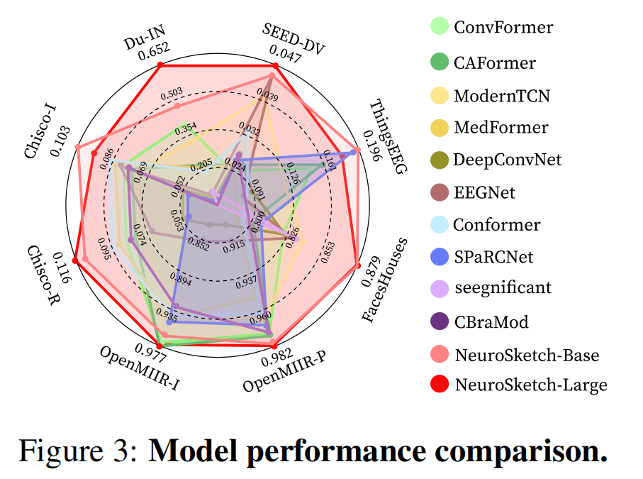

<div align=center>

</div>

<div align=center>
<a src="https://img.shields.io/badge/%F0%9F%93%96-Arxiv_2512.09524-red.svg?style=flat-square" href="https://arxiv.org/abs/2512.09524">

</a>
**TL;DR:** We propose an effective framework, NeuroSketch, for neural decoding via systematic architectural optimization.

In this study, we propose NeuroSketch, an effective framework for neural decoding via systematic architecture optimization. Starting with the basic architecture study, we find that CNN-2D outperforms other architectures in neural decoding tasks and explore its effectiveness from temporal and spatial perspectives. Building on this, we optimize the architecture from macro- to micro-level, achieving improvements in performance at each step. The exploration process and model validations take over 5,000 experiments spanning three distinct modalities (visual, auditory, and speech), three types of brain signals (EEG, SEEG, and ECoG), and eight diverse decoding tasks. Experimental results indicate that NeuroSketch achieves state-of-the-art (SOTA) performance across all evaluated datasets, positioning it as a powerful tool for neural decoding. The complete experimental results are available at https://github.com/Galaxy-Dawn/NeuroSketch_Results.

## :rocket: News

- 📣 2025/12/11:  We introduced a new variant of NeuroSketch for speech decoding, named NeuroSketch‑SD. This version contains approximately 20M parameters, offering a higher model capacity for decoding speech information from brain signals.
  Specifically, we have optimized the feature dimension across stages, the downsampling strategy, the convolutional design, the FFN structure, and the activation function to enhance decoding performance.
- 📣 2025/12/9:  We made NeuroSketch public!


## Roadmap
Our study is guided by two core questions that aim to systematically investigate how to design an effective framework for neural decoding:

- Q1: Which basic model architecture is best suited to capture temporal and spatial patterns in brain signals?

- Q2: Based on an appropriate architecture, how can we improve neural decoding performance through macro-to-micro architectural optimization?


As shown in Figure 1, by answering the above questions, we consistently improve the decoding performance at each optimization step.

<p align="center">
  
</p>

## Model Architecture

After the optimizations mentioned above, we have developed an effective framework, NeuroSketch. The overall architecture is shown in Figure 2(c). Like CNN-2D, NeuroSketch employs a 2D input representation, which is then processed by a stem layer to initiate feature extraction. The following forward propagation process is divided into four stages to progressively capture features from low-level to high-level. Following the four stages, the resulting feature is passed through a generalized mean (GeM) pooling layer that aggregates features along the channel and temporal dimensions. The pooled representation is then fed into a linear layer for the final classification. Additional details of the architecture and implementation can be found in Appendix D.2.

<p align="center">
  
</p>

## Main Results
As shown in Figure 3, NeuroSketch outperforms all selected baselines, underscoring its strong capacity to model brain signals across diverse decoding scenarios.

<p align="center">
  
</p>

## ⚡Quick Start

### 📁 Dataset Preparation

| Dataset       | URL                                                                 |
|---------------|---------------------------------------------------------------------|
| Du-IN         | [Download](https://huggingface.co/datasets/liulab-repository/Du-IN)             |
| Chisco        | [Download](https://openneuro.org/datasets/ds005170/versions/1.1.2)              |
| FacesHouses   | [Download](https://purl.stanford.edu/zk881ps0522)                               |
| ThingsEEG     | [Download](https://osf.io/hd6zk/)                                               |
| SEED-DV       | [Apply](https://bcmi.sjtu.edu.cn/ApplicationForm/apply_form/)                |
| OpenMIIR      | [Download](https://academictorrents.com/details/c18c04a9f18ff7d133421012978c4a92f57f6b9c) |

Note: SEED-DV dataset requires manual application approval before download.

### 🔧Setup
1. **Clone Repository**
```bash
git clone 
https://github.com/Galaxy-Dawn/NeuroSketch.git
```
2. **Configure Paths**
```bash
cd ./run/conf/dir/
```
Modify `local.yaml` to set up your local environment paths in YAML format.
```yaml
# Directory Configuration

# Path configurations for data and output management

data_dir:          # Path to raw downloaded datasets (required)
processed_dir:     # Path for processed/stage data storage (required)
output_dir:        # Training output directory (recommended: /root/NeuroSketch/output)
logging_dir:       # Training logs directory (recommended: /root/NeuroSketch/output/log)
model_dir:         # Weights & Biases (wandb) output directory (recommended: /root/NeuroSketch/output/train)
model_save_dir:    # Directory for saved model checkpoints
sub_dir:           "./"  # Relative path supplement (default: current directory)
```
3. **Prepare dataset**
```bash
cd ./run/scripts/prepare_data
# Run individual dataset scripts
```
Outputs will be saved to your configured `processed_dir` in `local.yaml`

### 🔬 Experiments
1.**Roadmap Part**

```bash
cd ./run/scripts/roadmap
# Run individual scripts
```

2.**Experiment Part**
```bash
cd ./run/scripts/exp
# Run individual scripts
```

## :book: Citation
If you find this work useful for your research or applications, please cite using this BibTeX:
```bibtex
@misc{zhang2025neurosketcheffectiveframeworkneural,
      title={NeuroSketch: An Effective Framework for Neural Decoding via Systematic Architectural Optimization}, 
      author={Gaorui Zhang and Zhizhang Yuan and Jialan Yang and Junru Chen and Li Meng and Yang Yang},
      year={2025},
      eprint={2512.09524},
      archivePrefix={arXiv},
      primaryClass={q-bio.NC},
      url={https://arxiv.org/abs/2512.09524}, 
```

